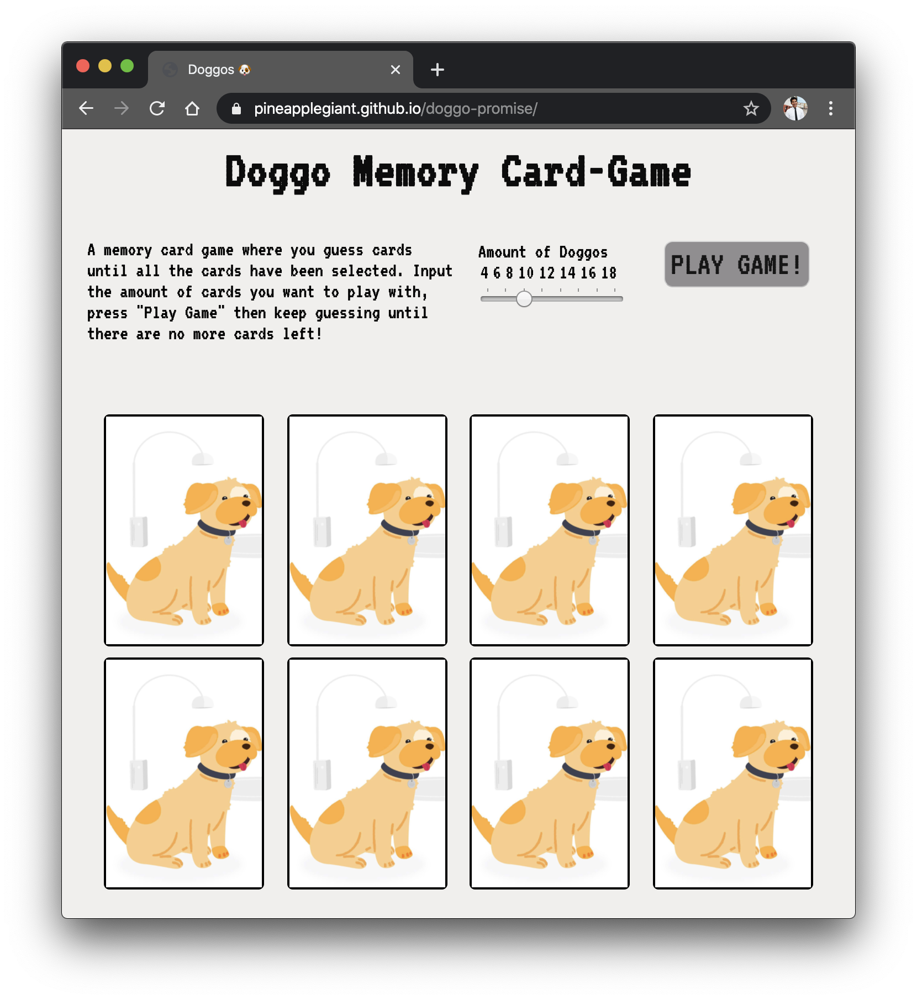

# Doggo-Promise JS

A scrappy built card game with doggos :') 🐶

## Special Thanks

>To all of the puppers out there in the world

* Barbara Fondrieschi for the [doggo images](https://www.behance.net/gallery/74559013/Pups?tracking_source=search%7Cdog&isa0=1) that I stole.
* [Dog.ceo](https://www.youtube.com/watch?v=dQw4w9WgXcQ) for their amazing dog as a service API!!! (Click the dog image above).
* The [FCC](https://www.youtube.com/watch?v=ZniVgo8U7ek) community for giving me some ideas on how to tackle the problem.

## Built With/Things I learned:
* The [Vanilla JS](http://vanilla-js.com/) framework.
* I learned about [promises](https://developer.mozilla.org/en-US/docs/Web/JavaScript/Reference/Global_Objects/Promise) - fetch's and response's json's
* How to do flip animation stuff!
